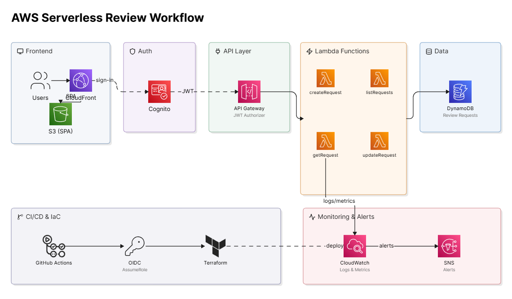
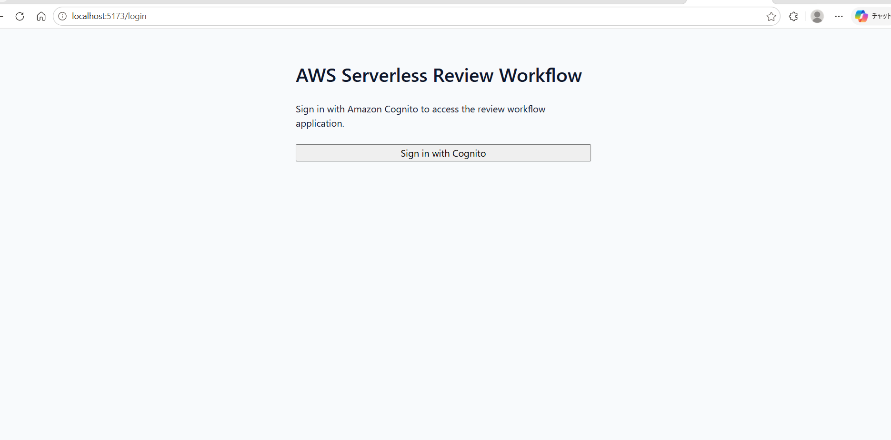
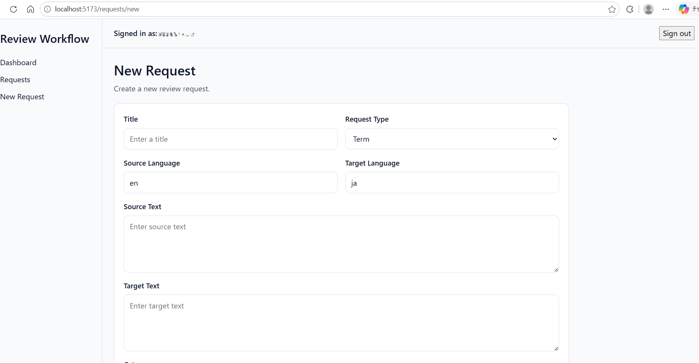
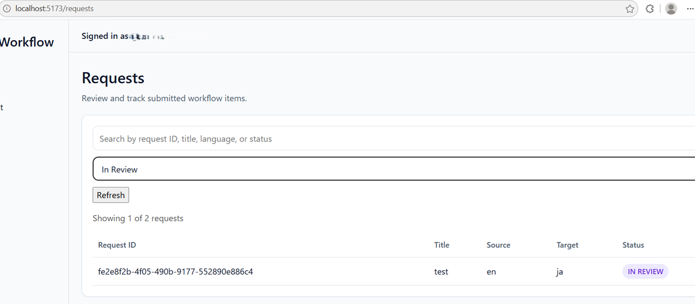
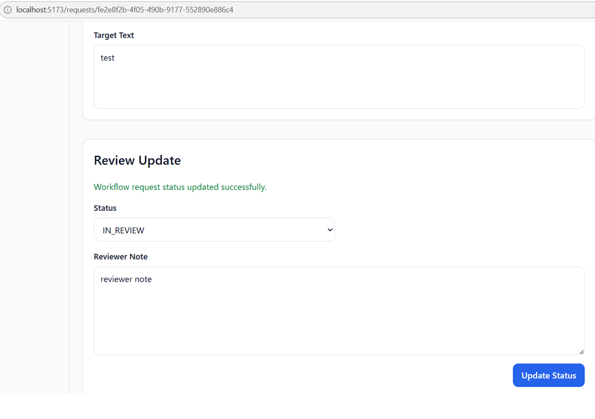

# AWS Serverless Review Workflow Platform

## Overview

This project is a serverless internal workflow application built on AWS for technical terminology and document review processes.

It uses Terraform, Amazon Cognito, API Gateway, AWS Lambda, DynamoDB, and CloudWatch today, with S3, CloudFront, SNS, and GitHub Actions planned (see [Status](#status)).

## Architecture

The dev environment uses Cognito for authentication, API Gateway and Lambda for backend processing, DynamoDB for data storage, and CloudWatch for monitoring and alerts. The frontend currently runs from a local dev server; S3/CloudFront hosting, SNS alerting, and a CI/CD pipeline are planned follow-ups, not yet provisioned.



## Scope

- User authentication with Amazon Cognito
- Protected API with a JWT authorizer
- Create and track review requests
- Update workflow status and reviewer notes
- Filter and search requests
- Basic monitoring and alerting
- CI validation and deployment workflow

## Tech Stack

- Terraform
- Amazon Cognito
- API Gateway HTTP API
- AWS Lambda
- DynamoDB
- CloudWatch
- S3 (planned)
- CloudFront (planned)
- SNS (planned)
- GitHub Actions (planned)

## Repository Structure

```text
aws-serverless-review-workflow/
├─ app/
│  ├─ frontend/
│  └─ functions/
├─ infra/
│  ├─ modules/
│  └─ environments/
├─ docs/
│  ├─ architecture/
│  ├─ adr/
│  ├─ api/
│  ├─ runbooks/
│  └─ demo/
├─ tests/
├─ diagrams/
└─ .github/workflows/
```

## Local Development

For local setup, Terraform apply and destroy steps, frontend environment variables, and troubleshooting notes, see:

[docs/local-development.md](docs/local-development.md)

## Remote state

Terraform state for the dev environment lives in S3, with a DynamoDB table for
locking. The bucket and lock table are the ones provisioned by the bootstrap in
[aws-infrastructure-core](https://github.com/KaoriKunimasu/aws-infrastructure-core)
(`bootstrap/backend`); this repo just points at them. Backend values are kept in
a gitignored `backend.hcl` (template: `infra/environments/dev/backend.hcl.example`):

```bash
cd infra/environments/dev
cp backend.hcl.example backend.hcl   # fill in the real bucket and lock table
terraform init -backend-config=backend.hcl
```

Rationale and the alternatives considered are in
[docs/adr/0002-remote-state.md](docs/adr/0002-remote-state.md).

## Security Considerations

- JWT-protected API routes
- Least-privilege IAM design
- No long-lived AWS credentials in source control
- Remote Terraform state in S3 with DynamoDB locking (see [Remote state](#remote-state))
- OIDC authentication from GitHub Actions to AWS (planned, see Status)
- Authentication is enforced server-side, but there is no per-owner
  authorization yet: any signed-in user can view and update any request in
  the shared queue (see [frontend-auth.md](docs/architecture/frontend-auth.md))

## Cost Considerations

- Serverless-first design to keep idle cost low
- DynamoDB on-demand billing
- Static frontend delivery through S3 and CloudFront
- No always-on compute in the MVP
- Dev resources can be destroyed after validation

## Status

The core workflow is implemented in the dev environment.

**Implemented:**

- Cognito authentication with hosted UI login
- JWT-protected API routes
- Request list view
- Request creation flow
- Request detail view
- Request status and reviewer note updates
- Client-side request filtering and search
- Basic CloudWatch monitoring alarms
- Local development and troubleshooting documentation

**Planned follow-up improvements:**

- Dashboard summary
- Additional architecture and demo documentation
- CI/CD and deployment polish

## Roadmap

### Phase 1
- Repository bootstrap
- Project documentation
- API and architecture skeleton

### Phase 2
- Frontend scaffold
- Terraform root scaffold
- Module skeletons

### Phase 3
- Cognito
- DynamoDB
- Lambda base
- HTTP API with JWT authorizer

### Phase 4
- Request create/read/update workflow
- Dashboard
- Frontend integration

### Phase 5
- Monitoring and alerting
- GitHub Actions CI
- OIDC deployment flow

### Phase 6
- Runbooks
- ADRs
- Demo assets

## Screenshots

A short walkthrough of the main workflow.

### Sign in (Amazon Cognito)


### Create a review request


### Track and filter requests


### Update review status

